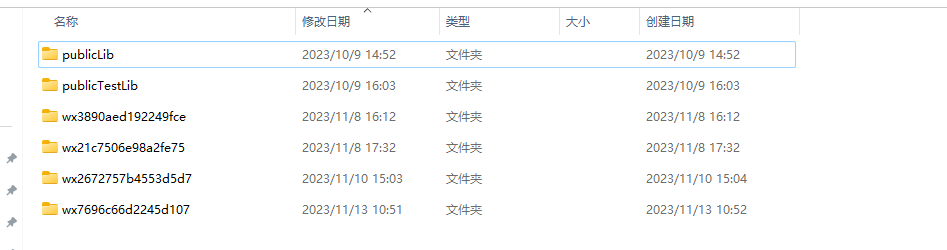
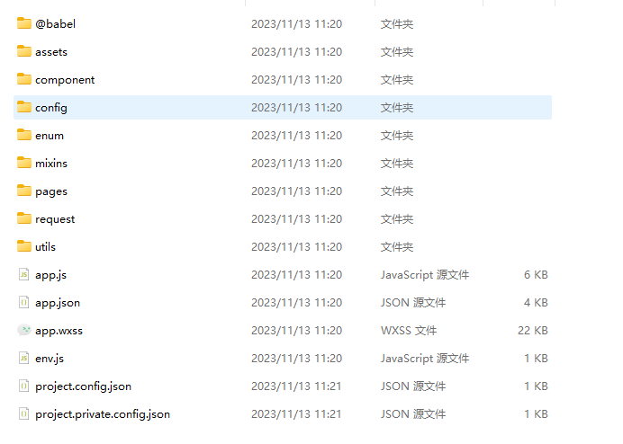
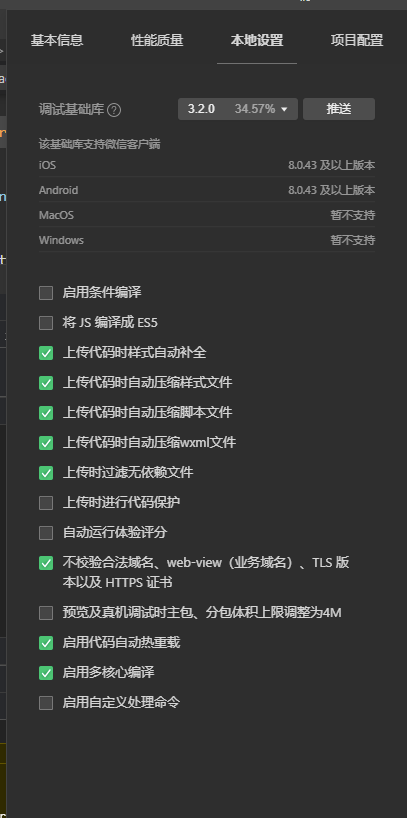
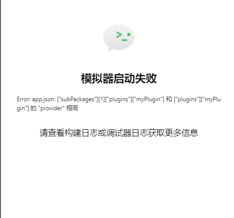
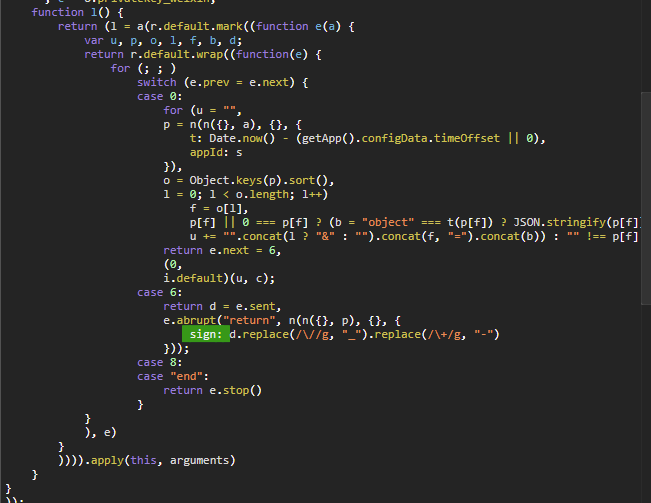
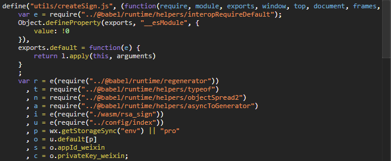
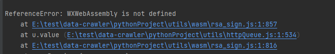
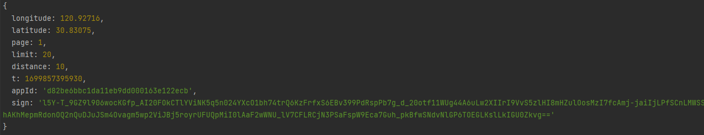
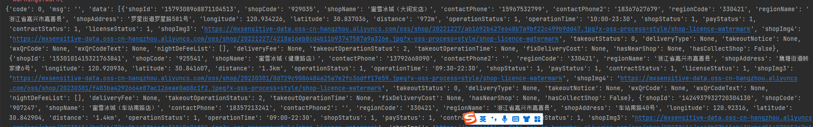

# 目标

目标：某雪冰城签名效验

网址：小程序   


### 抓包分析

本例属于比较基础的加密例子，只要花点时间都可以完整的扣下来加密代码。首先通过fiddler抓包小程序发现加密参数***sign***


找到接口的加密参数后我们使用pc端逆向工具来下一步分析


### 小程序反编译

首先打开PC微信后进入想要逆向的小程序，接着打开此目录`Documents\WeChat Files\Applet\小程序id\XX\__APP__.wxapkg`，`__APP__.wxapkg`就是我们要找的加密包




如果分不清哪个是你要的小程序包，把这里的全删了如何重新点开，剩下的那个就是你需要的。pc端的小程序包是加密的，需要多一步解密的流程，不过我这里用unveilr（有需要的可以去github上找，应该是可以找到的）可以直接解密后拿到小程序的代码包



# 小程序调试

用微信开发者工具打开文件夹运行小程序，记得修改一下本地设置，把js编译成ES5的选项删除，现在主流的语法都是ES6，不然会有莫名奇妙的语法错误，还有把不合法的域名效验勾上。



接下来需要对小程序的一些环境进行修复，毕竟使用的不是同一个环境，找到报错的原因把报错的内容删了就可以。



修复好之后点击点餐选择可以找到发送的接口以及相应的加密参数**sign**


## 获取 sign

通过搜索关键字的方法可以找到如下请求，我们基本可以确定Creatsign.js就是我们需要找的位置。


点开查看sign的位置可以发现这个签名是用函数l()生成的，由此我们找到参数的加密位置。我们在这里打上断点可以发现这个加密参数是通过变量**a**传入的经纬度参数来进行一个rsa加密，而加密函数**i**是由其他文件引入的这里直接可以在小程序包中把加密包引入一个合适的本地位置就可以使用。接下来我把代码放到本地运行尝试一下。






### 代码调试

运行代码报错主要是由于node环境的问题以及一些文件迁移的路径问题，我这里对一些参数进行了修改。Node.js 环境通常不提供浏览器中的 `WXWebAssembly` 对象。如果你想在 Node.js 中使用 WebAssembly，你需要使用 Node.js 提供的 `WebAssembly` 模块



这是修改之后的函数

```javascript
function w() {
    return (w = n(r.default.mark((function e() {
                        return r.default.wrap((function (e) {
                                for (; ; )
                                    switch (e.prev = e.next) {
                                    case 0:
                                        return e.abrupt("return", new Promise((function (e) {
                                                    l.add(d, {
                                                        res: e
                                                    }, (function () {
                                                            var e = l.get(d);
                                                            const fs = require('fs');
                                                            const filePath = path.join(__dirname, "rsa_sign_bg.wasm");
                                                            const buffer = fs.readFileSync(filePath);
                                                            // const buffer = fs.readFileSync("./rsa_sign_bg.wasm");
                                                            WebAssembly.instantiate(buffer, _).then((function (r) {
                                                                    var n = r.instance;
                                                                    for (o = n.exports, f = new Int32Array, s = new Uint8Array; e.length; )
                                                                        e.shift().res();
                                                                    l.delete(d)
                                                                }))
                                                        }))
                                                })));
                                    case 1:
                                    case "end":
                                        return e.stop()
                                    }
                            }), e)
                    })))).apply(this, arguments)
}

```

这是修改之前的

```
function w() {
    return (w = n(r.default.mark((function e() {
                        return r.default.wrap((function (e) {
                                for (; ; )
                                    switch (e.prev = e.next) {
                                    case 0:
                                        return e.abrupt("return", new Promise((function (e) {
                                                    l.add(d, {
                                                        res: e
                                                    }, (function () {
                                                            var e = l.get(d);
                                                            WXWebAssembly.instantiate("/utils/wasm/rsa_sign_bg.wasm.br", _).then((function (r) {
                                                                    var n = r.instance;
                                                                    for (o = n.exports, f = new Int32Array, s = new Uint8Array; e.length; )
                                                                        e.shift().res();
                                                                    l.delete(d)
                                                                }))
                                                        }))
                                                })));
                                    case 1:
                                    case "end":
                                        return e.stop()
                                    }
                            }), e)
                    })))).apply(this, arguments)
}
```

经过修改后加密函数如下所示

```
const fs = require('fs');
var e = require("./@babel/runtime/helpers/interopRequireDefault");
Object.defineProperty(exports, "__esModule", {
    value: !0
}),
exports.default = function (e) { {
        return l.apply(this, arguments)
    }
};
var r = e(require("@babel/runtime/regenerator")), t = require("./@babel/runtime/helpers/typeof"), n = require("./@babel/runtime/helpers/objectSpread2"), a = require("./@babel/runtime/helpers/asyncToGenerator"), i = e(require("./utils/wasm/rsa_sign")), u = e(require("./config/index")), p = '' || "pro", o = u.default[p], s = o.appId_weixin, c = o.privateKey_weixin;
function l(jwd) {
    return (l = a(r.default.mark((function e(a) {
                        var u,
                        p,
                        o,
                        l,
                        f,
                        b,
                        d;
                        return r.default.wrap((function (e) {
                                for (; ; )
                                    switch (e.prev = e.next) {
                                    case 0:
                                        for (u = "",
                                            p = n(n({}, jwd), {}, {
                                                t: Date.now() - (-4445),
                                                appId: s
                                            }),
                                            o = Object.keys(p).sort(),
                                            l = 0; l < o.length; l++)
                                            f = o[l],
                                            p[f] || 0 === p[f] ? (b = "object" === t(p[f]) ? JSON.stringify(p[f]) : p[f],
                                                u += "".concat(l ? "&" : "").concat(f, "=").concat(b)) : "" !== p[f] && delete p[f];
                                        return e.next = 6,
                                        (0, i.default)(u, c);
                                    case 6:
                                        return d = e.sent,
                                        e.abrupt("return", n(n({}, p), {}, {
                                                sign: d.replace(/\//g, "_").replace(/\+/g, "-")
                                            }));
                                    case 8:
                                    case "end":
                                        return e.stop()
                                    }
                            }), e)
                    })))).apply(this, arguments)
}
async function getSign(jwd) { {
        const result = await l(jwd);
        console.log(result);
    }
};
var aaa = {
  "longitude": 120.92716,
  "latitude": 30.83075,
  "page": 1,
  "limit": 20,
  "distance": 10
}
getSign(
    aaa
)
```

得到的结果与抓包的响应类似，应该是完整的扣下来了，为了防止万一，简单的写个request请求验证一下，发现没问题就可以直接拿来使用了。这里sign主要是通过经纬度传参加密的方式来获取经纬度附近的店铺信息


### 结果验证

接口里面的信息大多是店铺的详细地址

